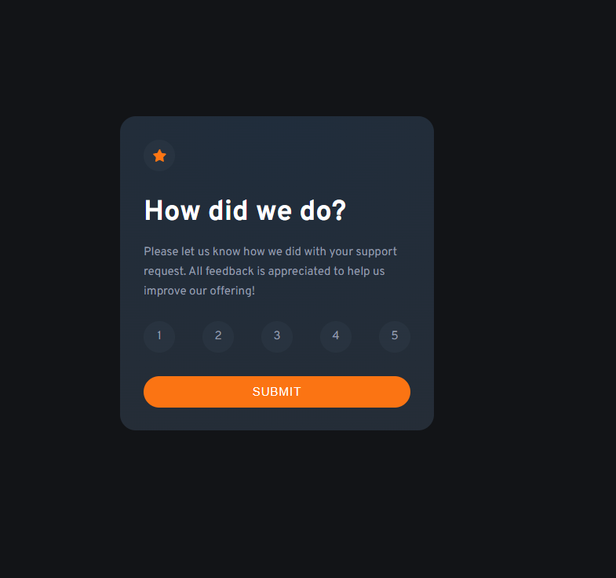
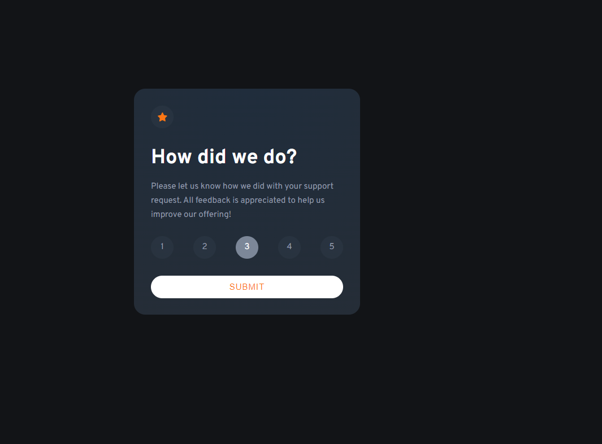
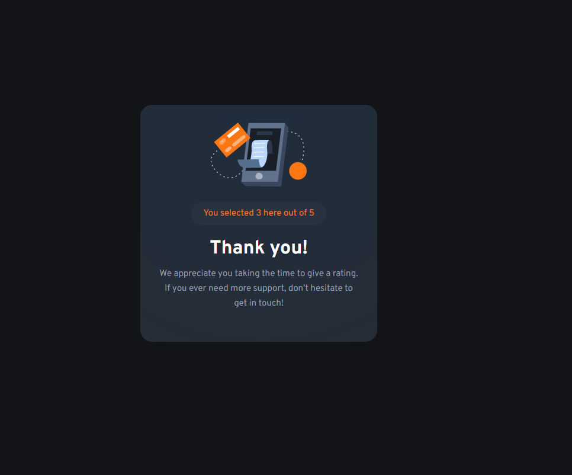

# Frontend Mentor - Interactive rating component solution

This is a solution to the [Interactive rating component challenge on Frontend Mentor](https://www.frontendmentor.io/challenges/interactive-rating-component-koxpeBUmI). Frontend Mentor challenges help you improve your coding skills by building realistic projects. 

## Table of contents

- [Overview](#overview)
  - [The challenge](#the-challenge)
  - [Screenshot](#screenshot)
  - [Links](#links)
- [My process](#my-process)
  - [Built with](#built-with)
  - [What I learned](#what-i-learned)
  - [Continued development](#continued-development)
  - [Useful resources](#useful-resources)
- [Author](#author)
- [Acknowledgments](#acknowledgments)

## Overview

### The challenge

Users should be able to:

- View the optimal layout for the app depending on their device's screen size
- See hover states for all interactive elements on the page
- Select and submit a number rating
- See the "Thank you" card state after submitting a rating

### Screenshot

### Links

- Solution URL: [Add solution URL here](https://your-solution-url.com)
- Live Site URL: [Add live site URL here](https://your-live-site-url.com)

## My process

I wanted to do this project using only html, css and js. Now I'm not sure about the way I approched sending the user the "Thank you page". I feel like I should have done it using diferent
urls for each. 

### Built with

- Semantic HTML5 markup
- CSS custom properties
- Flexbox

### What I learned

~~~ javascript
        let rvl = rateValueList[0];
        while (rvl){
            if (rvl.tagName === "LI"){
                rvl.classList.remove("active")
            }
            rvl = rvl.nextSibling
        }
        this.classList.add("active")
~~~

The script above it is used for passing the "active" class for one sibling to another.
I just found it somewhere I'm not really sure what it really does though.

### Continued development

Use this section to outline areas that you want to continue focusing on in future projects. These could be concepts you're still not completely comfortable with or techniques you found useful that you want to refine and perfect.

## Author
- Frontend Mentor - [@@mihaiches](https://www.frontendmentor.io/profile/mihaiches)

## Acknowledgments

This is where you can give a hat tip to anyone who helped you out on this project. Perhaps you worked in a team or got some inspiration from someone else's solution. This is the perfect place to give them some credit.

**Note: Delete this note and edit this section's content as necessary. If you completed this challenge by yourself, feel free to delete this section entirely.**
